# How to Deply Kubernetes Cluster on Hatzner Cloud

In this guide we will setup the kubernetes cluster on the hatzner cloud from scratch.

## 1. Create Private Network

We have to create a private network first to which we will bind to our servers.

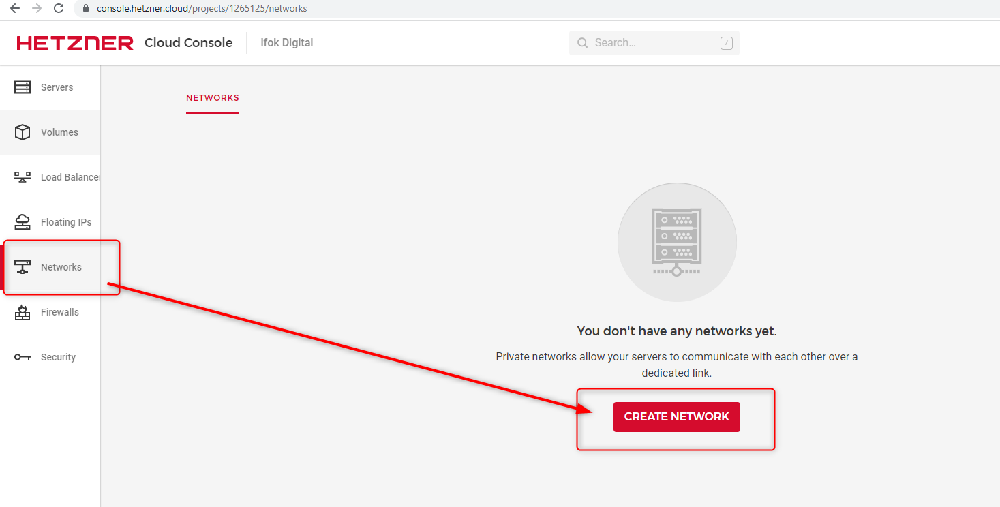
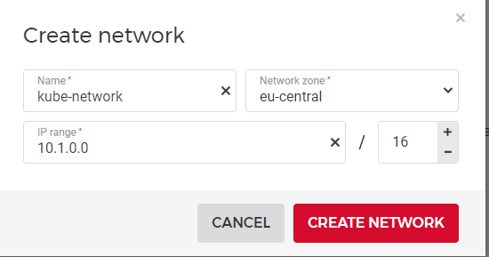

## 2. Generate API Token

We will generate an API token with **Read & Write** permissions.

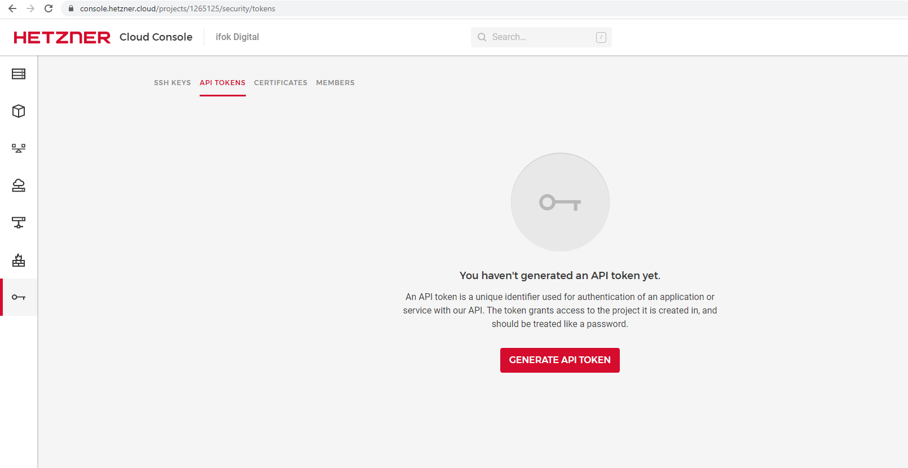
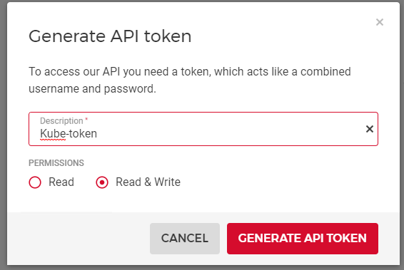

## 3. Create Servers

Now we will create two servers i.e. one for kubernetes master/controller and the second one for the worker node.

while creating the each server we will assign the **kube-network** which we created in step.1 to them.

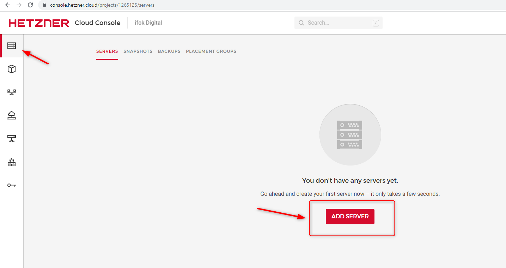
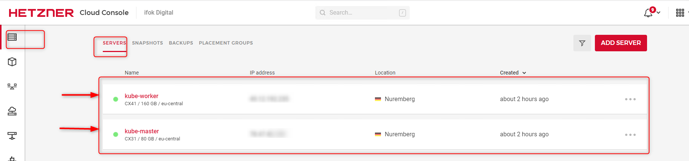

Once servers are ready we will change root passwords. We have to click on each server from above mentioned list and then go to the rescue tab and change root password. it will show you password once so make sure you note it down somewhere

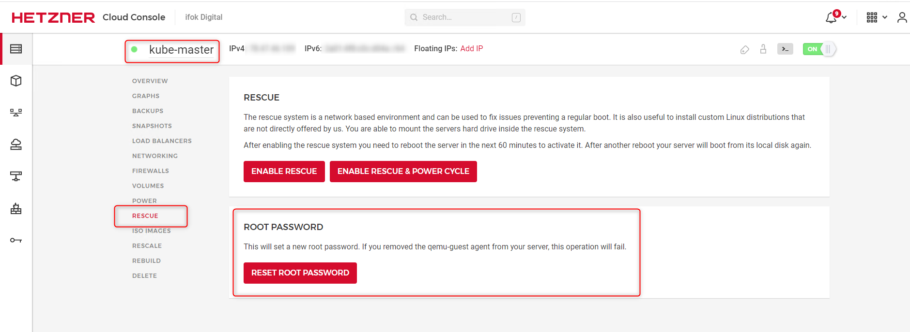

## 4. Configure Servers

Once servers are ready we will install some prerequisites tools on them. all you have to do is ssh into the both server using following command

```bash
ssh root@<server-IP>
```

It will prompt for the password.

Then you have to run following commands

```bash
apt update && apt upgrade -y && apt full-upgrade -y && apt install vim -y

wget https://raw.githubusercontent.com/0hlov3/kubernetes-on-hetzner/main/k8s-ubuntu-install/install.sh && chmod +x install.sh && 
./install.sh
```

**NOTE: make sure while copy/paste that command is fine.**

## 5. Initialize Kubernetes Cluster

### 5.1 Intialize Kubernetes Master/Controller

On your master node you have to run the following command.

```bash
kubeadm init --apiserver-advertise-address $externalIPv4 --apiserver-cert-extra-sans $PrivateIP,$externalIPv4 --control-plane-endpoint $PrivateIP --pod-network-cidr 10.244.0.0/16

#in my case the above command looks like 
kubeadm init --apiserver-advertise-address 78.60.76.10 --apiserver-cert-extra-sans 10.1.0.2,78.60.76.10 --control-plane-endpoint 10.1.0.2 --pod-network-cidr 10.244.0.0/16
#this command will return a join worker commmand which you will execute as it is on your worker nodes

#then export kube config env variable
export KUBECONFIG=/etc/kubernetes/admin.conf 
```

### 5.2 Create Kubenetes Cluster's Worker node

you have to run the join command that you get from above step on your worker node. In my case it was looks like

```bash
kubeadm join 10.1.0.2:6443 --token sfw773.elb1ecbsaszh42fl --discovery-token-ca-cert-hash sha256:b3e92asjhdkajf3223aee88485jkdhaskjd3fa3c3ff805d236e15163994ffadb
```

### 5.3 Configure your Kubernetes Master/Controller

Once your worker joined. goto on your master node and run following command

```bash
kubectl get nodes -o wide
```

you will see the output like following, where you can see that status is not ready and your externel IP is reffered as your cluster's internal IP.

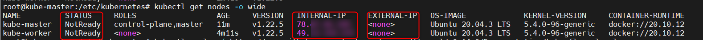

Now you have to install network plugins. we will use **kube-flannel** using following command(on master).

```bash
kubectl apply -f https://raw.githubusercontent.com/coreos/flannel/v0.14.0/Documentation/kube-flannel.yml

kubectl -n kube-system patch ds kube-flannel-ds --type json -p '[{"op":"add","path":"/spec/template/spec/tolerations/-","value":{"key":"node.cloudprovider.kubernetes.io/uninitialized","value":"true","effect":"NoSchedule"}}]'
```

and then check again pods using `kubectl get nodes -o wide`, this issue seems fixed and nodes are in ready state

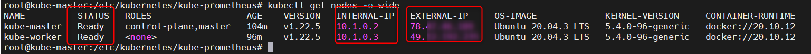

Now, we have to setup the cloud controller manager by using following commands

```bash
kubectl -n kube-system create secret generic hcloud --from-literal=token=<hcloud API token> --from-literal=network=<hcloud Network_ID_or_Name>

#in my case above command was looks like following
kubectl -n kube-system create secret generic hcloud --from-literal=token=JeZ3yahMMEisajhdgjasgdjhasdjhablmwnW6Epn3GS3PIisSVKlO9xKe --from-literal=network=kube-network

kubectl apply -f https://github.com/hetznercloud/hcloud-cloud-controller-manager/releases/latest/download/ccm-networks.yaml
```

Now, we have to install Container Storage Interface Driver so that we can use persistent volumes.

```bash
kubectl -n kube-system create secret generic hcloud-csi --from-literal=token=<hcloud API token> --from-literal=network=<hcloud Network_ID_or_Name>

#in my case above command was looks like following
kubectl -n kube-system create secret generic hcloud-csi --from-literal=token=JeZ3yahMMEi0cetrJPkdx2jmfsadjhasjkdhaksjkspn3GS3PIisSVKlO9xKe

kubectl apply -f https://raw.githubusercontent.com/hetznercloud/csi-driver/v1.6.0/deploy/kubernetes/hcloud-csi.yml
```

### 5.4 Test Cluster

Now we are done. Lets check our cluster by creating a test deployment

```bash
kubectl apply -f https://raw.githubusercontent.com/0hlov3/kubernetes-on-hetzner/main/test-deployment/csi-pvc-test.yaml

kubectl get pod
kubectl get pvc
```


above mentioned `get pod` & `get pvc` commands whil show you the pod and pvc has been created succefully. It means, our cluster is working fine. Now we can remove this test deployment using following commands.

```bash
kubectl delete pod my-csi-app
kubectl delete pvc csi-pvc
```

## 6. Deploy HELM

Now, we will install helm so that we can easily deploy prometheus and grafana using helm charts. To install helm, execute following commands

```bash
curl -fsSL -o get_helm.sh https://raw.githubusercontent.com/helm/helm/main/scripts/get-helm-3

chmod 700 get_helm.sh

./get_helm.sh
```

## 7. Deploy Grafana & Prometheus Using HELM

To deploy grafana and prometheus, we will use following commands

```bash
helm repo add stable https://charts.helm.sh/stable

helm repo add prometheus-community https://prometheus-community.github.io/helm-charts

helm repo update

helm install prometheus prometheus-community kube-prometheus-stack -n grafana --create-namespace
```

Now we can check pods or services status using following commands.

```bash
kubectl get pods -n grafana
kubectl get svc -n grafana
```

and we can access it on http://localhost:3000. 
```
grafana dashboard details:
username: admin
password: prom-operator
```
To make it accessible from remote machines, we will deploy hatzner load balancer and ingress-nginx to route the trafic.

## 8. Create Hatzner Loadbalancer

Goto loadbalancer tab in hatzner cloud console and create a loadbalancer. all you have to do is attach it to a private network that we created earlier with the name `kube-network`.

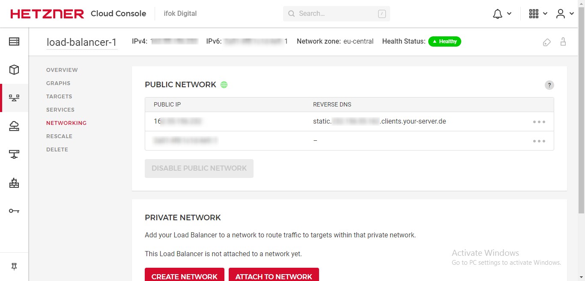

Once you deployed. note down your reserved DNS name from network tab in loadbalancer.

## 9. Deploy ingress-nginx in cluster

To deploy ingress-nginx we will use the helm charts. 

```bash
helm upgrade --install ingress-nginx ingress-nginx \
  --repo https://kubernetes.github.io/ingress-nginx \
  --namespace ingress-nginx --create-namespace
```

Now we can check the status of ingress using following command.

```bash
kubectl describe svc/ingress-nginx-controller -n ingress-nginx
```

Now, configure ingress-nginx service so that it can talk to loadbalancer. Run the following command

```bash
kubectl edit svc/ingress-nginx-controller --namespace=ingress-nginx
```

Now, this will open up the configuration file. we will add following annotations. (please update your LB location and name)

```bash 
load-balancer.hetzner.cloud/location: Nuremberg
load-balancer.hetzner.cloud/name: load-balancer-1
```

Now, go back to loadbalancer on hatzner cloud and add target machine. you will see that in few seconds your Loadbalancer status will be healthy. Thats mean our loadbalancer is configured with ingress.

## 10. Create Routing for Grafana & Prometheus

create a grafana-ingress.yaml file and past following content. 

```
apiVersion: networking.k8s.io/v1
kind: Ingress
metadata:
  name: grafana-ingress
  namespace: grafana
  annotations:
    kubernetes.io/ingress.class: nginx
    nginx.ingress.kubernetes.io/ssl-redirect: "false"
    nginx.ingress.kubernetes.io/use-regex: "true"
    nginx.ingress.kubernetes.io/rewrite-target: /$1
spec:
  rules:
  - host: <your-loadbalancer's reserved DNS>
    http:
      paths:
      - backend:
          service:
            name: prometheus-grafana
            port:
              number: 3000
        path: /?(.*)
        pathType: Prefix
```

please don't forget to update your loadbalancer's reserved dns in host attribute and note that we are specifying the same namespace in which our grafana is running. Now we will apply this file.

```bash
kubectl apply -f grafana-ingress.yaml
```

Now from any remote we can access our grafana dashboard using reserverd dns of our loadbalancer. for my scenario it looks like http://static.323.157.45.152.clients.your-server.de

It will show the following dashboard login page, and we can login using username and password mentioned in step:7 of this article.

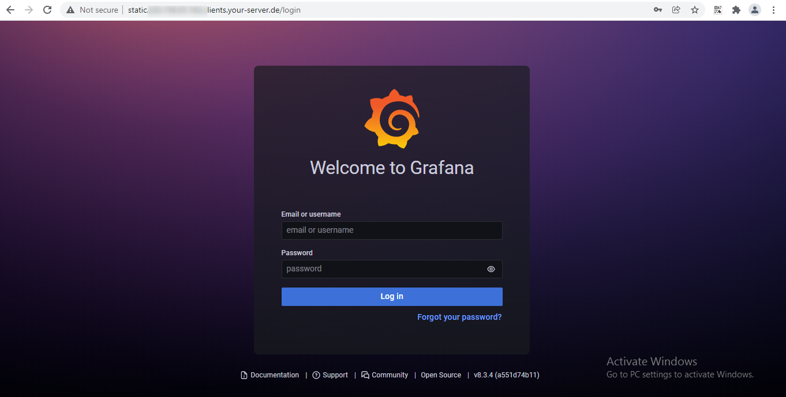

All done. Please dont forget to star to support me. Let me know with your valuable feedback in Discussion tab: [click here](https://github.com/Haris3243/hatzner-kube-cluster/discussions)

